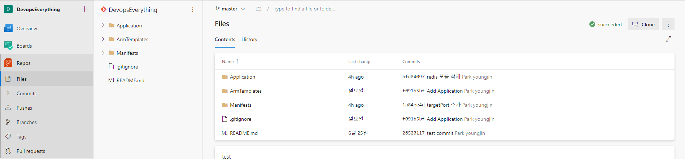
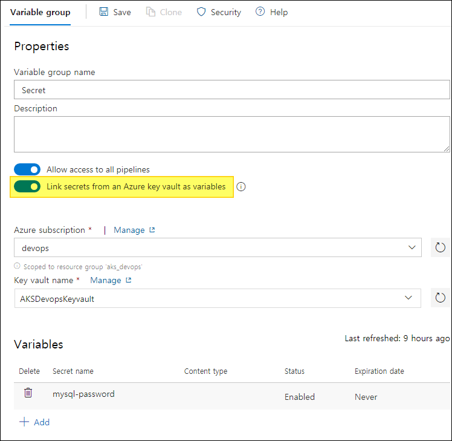

[Azure Devops 프로젝트 위치](https://dev.azure.com/TestingProjectCM/DevopsEverything)
# Azure Devops와 AKS배포 관리(1) - 프로젝트 시작부터 Docker 이미지 빌드
## Azure Devops
Azure Devops는 아래와 같이 많은 기능들을 제공하고있다.
> - Dashboard - 프로젝트의 전반적인 현황을 한눈에 볼 수 있다.
> - Board - 에자일 방법론에 맞게 계획을 세우고 반복할 수있다.
> - Wiki - 필요한 문서를 Markdown형식으로 쉽게 작성하고 저장할 수있는 공간을 제공한다.
> - Repos - 소스코드를 관리 할 수있고 Git, TFVC 등을 제공하며, github과 연동이 가능하다.
> - Pipelines - 배포, 빌드에 필요한 파이프라인 기능을 제공하며, 파이프라인에 필요한 변수, 배포환경과 패키지 등을 관리 할 수있다.
> - Test plans - Code에 대한 Test 기능을 제공한다.

위 기능만 봐도 Devops 도구의 기능들이 대부분 포함되어 있다. 그리고 Azure Cloud와 쉽게 연동 할 수있도록 제공하고 있다. Azure Devops에서 Azure Cloud를 통해 어플리케이션을 배포하고 운영하게되면 Azure의 platform 의존성은 생기지만 학습이 쉽고 관리 포인트를 줄일 수있다. 그리고 개발, 배포, 테스트에 대한 주기가 짧아져 개발과 운영이 빨라지는 것을 기대할 수있다.

## AKS(Azure Kubernetes Service)
Kubernetes는 컨테이너 기반 어플리케이션과 네트워크 및 스토리지 구성 요소를 관리하는 플랫폼이다. 관리 작업을 위한 API들을 통해 선언적 배포 방식을 제공한다. 어플리케이션의 가용성을 오케스트레이션하고 마이크로 서비스 기반 어플리케이션을 구축하고 실행 할 수있다. AKS는 Azure에서 관리되는 Kubernetes 클러스터로 간단히 배포되며 상태 모니터링 및 유지 관리 같은 중요 작업을 처리해줌으로써 관리 복잡성 및 운영에 대한 부하를 줄여준다.

Azure Devops에서 AKS와 쉽게 통합할 수있도록 제공하고있다. 그리고 Devops 도구를 통해 Kubernetes를 얼마나 관리 및 운영 할 수 있는지 알아보았다.

# 구현 목표
1. Azure Cli를 통해 필요한 Infra를 배포.
2. 파이프라인에 필요한 변수를 저장하고, KeyVault를 이용해 Secret 변수를 사용.
3. 파이프라인을 통해 소스코드를 빌드하고 배포.
4. Manifest 파일을 통해 Kubernetes에 Application을 배포.
5. 모니터링 Kubernetes Prometheus 사용.
6. ARM template으로 IaC 구현.

# Devops 구현
## Board
Devops에서 대시보드는 중요한 역할을한다. 프로젝트의 개발과 운영 과정을 하나의 대시보드로 관리하고 팀원들의 소통을 묶어주는 역할을 한다. Azure Devops에서는 Board기능을 프로젝트의 특성에 맞게 사용할 수 있도록 제공하고있다.
> - Basic - 가장 기본적인 기능을 제공하며, `Epics` `Issue` `Task` 의 티켓단위로 작업을 처리한다.
> - Agile - 에자일 프로세스를 기반으로 만들어져있으며, `Epic` `Feature` `UserStory` `Bug` `Issue` `Task` 로 작업을 처리한다.
> - Scrum - 스크럼 프로세스이며 `Product backlog item` 으로 `backlog`를 사용한다.
> - CMMI - CMMI 프로세스이며 `요구사항(Requirement)` 기준으로 작업을 처리한다.

구현을 위해 Basic 프로세스로 생성하고, Issue, Task를 등록했다.  


## Repo
Repo는 소스코드 관리를 지원하고 있으며 Git과 TFVC를 제공하고있다. 

Git repository를 생성하고, 프로젝트에 사용할 소스코드를 Push 했다.  


**Board의 티켓에 Repo의 branch를 연결하고 이슈를 추적 및 관리 할 수있다.**  
작년 프로젝트에서 Task하나당 Branch 하나로 업무를 진행한 적이 있다. Pull Request로 팀원 혹은 팀장의 승인을 받으면 해당 Task는 자동으로 Done 상태로 변경되고 바로 다음 작업을 수행했다. 
(참고) Commit 메세지에 task id를 적으면 자동으로 Done 상태가 된다. [관련Docs](https://docs.microsoft.com/en-us/azure/devops/repos/git/resolution-mentions?view=azure-devops)  
  
Task만으로 개발내용을 동시에 추적가능하고 상태를 자동으로 변경 할 수있어 이러한 기능은 개발에 집중하는데 많은 도움이 된다.

## Build
Azure Devops는 다양한 환경의 어플리케이션에 대해 빌드, 배포를 할 수있도록 지원하고 있다. Pipeline에서 어플리케이션을 빌드하고 배포하는 환경을 구성할 수 있다.
로그인 api가 포함된 간단한 웹어플리케이션에 대해 Docker를 빌드하고 저장소로 Image를 푸시하는 빌드 파이프라인을 구성했다.

> ACR(Azure Container Registry)란?
Azure의 관리형 개인 Docker 컨테이너 이미지 스토리지 
[> 자세히](https://docs.microsoft.com/ko-kr/azure/container-registry/container-registry-intro)

### ACR 생성
Azure Portal의 Azure Cloud Shell을 사용하여 Azure Cotainer Registry(ACR)를 생성하고 Pipeline에 등록한다.
```
ACR_NAME=CMACR
RESOURCE_GROUP=CM_Devops
REGION_NAME=koreacentral

az acr create \
    --resource-group $RESOURCE_GROUP \
    --location $REGION_NAME \
    --name $ACR_NAME \
    --sku Standard
```
### Environment Variable
프로덕트를 개발하면서 설정값 관리는 매우 중요하다. 자주 변경 인프라 정보부터 ID/PW 같은 민감한 정보가 포함된 설정값의 경우 소스코드 외부에서 별개로 관리 되는데, Azure Devops는 프로젝트 내에서 사용할 설정값들을 저장하고 사용할 수있도록 제공하고있다.  
  
위 스크린샷처럼 Pipelines메뉴의 Library에서 Variable group안에 값을 생성할 수있다.
여기서 등록된 값들은 파이프라인에서 쉽게 사용할 수있으며, 유출되면 위험한 민감한 정보의 경우 Azure KeyVault와 연동해서 가져올 수있다.

**앞서 ACR생성에 설정한 변수들은 파이프라인에서 사용**

> - `Variable group`을 생성하고 변수 등록 가능.


> - Azure KeyVault에서 `secret`을 생성 후, 프로젝트와 연동함으로써 사용가능.
  

연동된 secret 값은 Azure Devops에서는 보이지않고
빌드시에도 secret은 `***` 으로 Replace되어 보여진다.


### Pipeline 구성
Devops의 핵심기능인 빌드 파이프라인을 구성해보자. Application의 `Source code`와 `환경변수`, `Container Image storage(ACR)`이 준비되어있다면 빌드 파이프라인을 구성할 수있다.

Kubernetes는 컨테이너 기반의 어플리케이션으로 작동한다. 따라서 빌드 파이프라인에는 Docker의 빌드와 ACR로의 Push가 필요하다.

파이프라인 구성은 아래와 같이 yaml로 직접 구성하거나, 
  
아래와같이 에디터를 사용할 수있다.  
  

두가지 방법 모두 가능하며, Docker build and push가 있는 기본 템플릿을 찾아 설정하면 된다.
> Container registry : 위에서 만든 ACR
> Container repository : 이미지 repository 이름
> Command : buildAndPush
> Dockerfile : Git repo에서 Dockerfile 경로 ex) Application/Dockerfile
> Build context : 빌드 경로 ex) Application
> Tags : $(build.buildId)
         latest

빌드 성공시 docker image가 성공적으로 ACR로 푸시 된것을 확인할 수있다.


# Azure Devops와 AKS배포 관리(2) - Docker 이미지의 AKS 배포
## Menifest 생성.
## Deploy
### AKS
- set secret 
[manifest inject variable](https://medium.com/@katlimruiz/how-to-inject-variables-in-kubernetes-manifest-with-azure-pipelines-e598755be9b)

## IaC (Infrastructure as Code) - Azure ARM Template

## 모니터링


## 걸림돌(마지막에 추가할것)
- aad role 추가 관련
1. build Pipeline의 최초 설정 중 ARM Template을 통해 ACR 생성 후, 바로 docker와 연결하지 못한다. -> 미리 만들어야함.
2. AKS에서 ACR을 접근가능하게 하기위해 attach과정이 필요하다. ARM template에서는 가능하지 않다고 한다. [>refer](https://github.com/MicrosoftDocs/azure-docs/issues/39508). 따라서 azure  cli를 통해 attach를 해준다.
3. 2번과정은 권한이 없다고 되지않는다. devops에서 azure subscription과 연결해주는 service connector 에서 권한이 없는것같다.
4. cloud shell과 같이 쓰는 수 밖에없다.

- AKS manifest 관련
1. yaml 설정의 변수화가 어렵다.

- mysql argu

- AKS image pull 정책